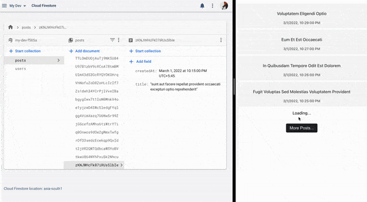

# Firebase firestore real-time pagination example

## Getting started

<div>
  
  
  
</div>

In this example demo app, we're fetching 4 posts at a time sorted by **createdAt** timestamp field in descending order. The real-time update listener is attached only for the first time fetched data. Hence, works only for newly created post with a **createdAt** timestamp of greater than initially fetched ones. New posts are showed at top of the list.

### Add firebase configuration file

Go to `./src/utils` folder and create a file with name `firebase-config.ts`. Add your firebase app configuration there. More info on getting started with firebase go to [https://firebase.google.com/docs/web/setup](https://firebase.google.com/docs/web/setup).

```js
export const firebaseConfig = {
  apiKey: "",
  authDomain: "",
  projectId: "",
  storageBucket: "",
  messagingSenderId: "",
  appId: "",
};
```

### Cloud Firestore

Head to your Cloud Firestore console and create a `posts` collection. Add few documents with a field of `title` (string) and `createdAt` (timestamp) and you're good to go. When you run the application you should already see some posts already fetched.

### Run application

```sh
yarn install # Install dependencies or npm install
```

```sh
yarn start
```

or

```sh
npm start
```

Runs the app in the development mode.\
Open [http://localhost:3000](http://localhost:3000) to view it in the browser.

The page will reload if you make edits.\
You will also see any lint errors in the console.
